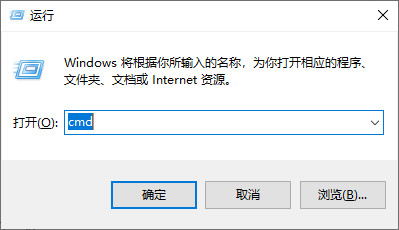

# Curve Fitting Toolbox

## I、总体介绍

​	欢迎使用本曲线拟合软件！本软件目标为：对于给定的样本采样点，通过不同的算法来拟合函数曲线。

- 通过Python中的tkinter库进行相关的界面制作，交互方便，界面美观、直观；
- 算法主要包括拉格朗日内插多项式、三次样条插值、最小二乘多项式近似以及三角函数多项式拟合4种；
- 支持读取".mat"、".csv"、".txt"这三种格式的文件，可以通过输入路径，浏览目标以及拖入文件三种方式完成文件的读取操作；
- 支持任意尺寸的输入数据，程序将自动适配算法；

## II、如何运行？

### 1、安装运行环境
- Windows操作系统
- 安装有Python语言解释器
  - 开发环境为Python==3.11.0
  - 实际测试中低版本Python，如3.9，也可以运行
- 需要以下三方库的支持：
  - matplotlib==3.6.1
  - numpy==1.23.4
  - scipy==1.9.3
  - sympy==1.11.1
  - windnd==1.0.7

### 2、安装运行流程

- 下载python环境并安装：https://www.python.org/downloads/windows/

  - 注意不要忘记配置环境变量，这可以让你正在系统控制台中直接调python与pip命令，即：安装过程中勾选以下栏：

    

  - 如果从conda建立虚拟环境，可以在控制台输入以下命令：

```shell
conda create -n <your env name> python=3.9
# 因为conda暂未更新至python3.11，这里选择3.9版本
```

- 安装第三方库

  - 同时按下win+r组合键，在运行栏中输入cmd，按下Enter：

  

  - 进入控制台后，直接输入以下代码，等待安装完成即可：

```shell
pip install matplotlib numpy sympy scipy windnd
```

- 进入项目所在的目录，输入以下代码运行程序：

```shell
 python -u .\main.py
```

## III、使用说明


如上图所示，整个GUI界面被分为了4个部分：

### ①区域：文件操作区

文件的读取主要有以下三种方式

- 可以通过输入文件路径后单击”读取“按钮读取对应文件
- 通过”浏览“按钮选择文件
- 将文件拖入窗体

### ②区域：数据操作区

主要有以下四种数据操作（对应4个按钮）：

- 增加：将新的坐标加入数据
- 删除：删去数据中的指定的坐标
- 修改：用输入的值替换数据中指定的坐标
- 清空：刷新所有数据

### ③区域：算法选择与输出区域

可以通过下拉框选择至多4种算法：

- Lagrange Polymial
- Cubic Spline Interpolation
- Least Square Approximation（可自定义阶数）
- Trigonometric Polynomial Approximation（可自定义阶数）

### ④区域：绘图区

可以通过”绘制”按钮实现函数的绘制功能，可视化拟合结果

## IV、具体的运行环境说明

```python
# 用到的Python版本：3.11.0
Python==3.11.0

# 可以使用conda建立虚拟环境
# 但在某些情况下matplotlib可能存在不兼容的情况
# 即发生:exited with code=3228369022 in * seconds
# （暂未查出原因，不知道为什么第二天就又可以跑了）

# 需要额外安装的包与对应版本
matplotlib==3.6.1
numpy==1.23.4
scipy==1.9.3
sympy==1.11.1
windnd==1.0.7

# 文件编码格式 UTF-8
# 因为注释全是中文,用其他编码打开会出现乱码
# UTF-8
```

